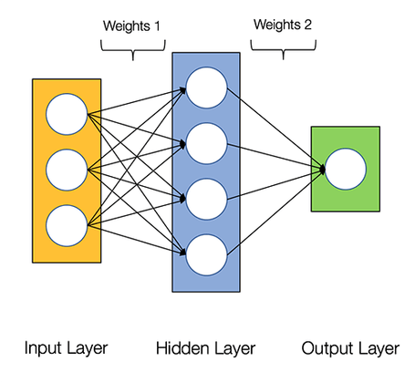

```{r setup, include=FALSE}
knitr::opts_chunk$set(echo = TRUE)
```

## Building a Neural Network

> This is a verbatim lift from a great R bloggers post by [Posts by Tychobora](https://www.r-bloggers.com/how-to-build-your-own-neural-network-from-scratch-in-r/).

Last week I ran across this great post on [creating a neural network in Python](https://towardsdatascience.com/how-to-build-your-own-neural-network-from-scratch-in-python-68998a08e4f6). It walks through the very basics of neural networks and creates a working example using Python. I enjoyed the simple hands on approach the author used, and I was interested to see how we might make the same model using R.

In this post we recreate the above-mentioned Python neural network from scratch in R. Our R refactor is focused on simplicity and understandability; we are not concerned with writing the most efficient or elegant code.

Our very basic neural network will have 2 layers. Below is a diagram of the network:



For background information, please read over the Python post. It may be helpful to open the Python post and compare the chunks of Python code to the corresponding R code below. The full Python code to train the model is not available in the body of the Python post, but fortunately it is included in the comments; so, scroll down on the Python post if you are looking for it.

Let’s get started with R!

### Create Training Data


```{r}
library(ggplot2)
```

First, we create the data to train the neural network

```{r}
X <- matrix(c(
  0,0,1,
  0,1,1,
  1,0,1,
  1,1,1
),
  ncol = 3,
  byrow = TRUE
)

# observed outcomes
y <- c(0, 1, 1, 0)

# print the data so we can take a quick look at it
cbind(X, y)
```

The above data contains 4 observations; each row is an observation. The 3 columns on the left (i.e. the X object) are used with the observed outcomes (“y” column on the right) to train the model. Once our model is trained, we will be able to pass new predictor variables (i.e. new rows of X) to the model and predict y values that have not yet been observed.

### Create an object to store the state of our neural network

Now that we have our data, we need to create the model. First, we create an object to store the state of the model.

```{r}
# generate a random value between 0 and 1 for each
# element in X.  This will be used as our initial weights
# for layer 1
rand_vector <- runif(ncol(X) * nrow(X))

# convert above vector into a matrix
rand_matrix <- matrix(
  rand_vector,
  nrow = ncol(X),
  ncol = nrow(X),
  byrow = TRUE
)

# this list stores the state of our neural net as it is trained
my_nn <- list(
  # predictor variables
  input = X,
  # weights for layer 1
  weights1 = rand_matrix,
  # weights for layer 2
  weights2 = matrix(runif(4), ncol = 1),
  # actual observed
  y = y,
  # stores the predicted outcome
  output = matrix(
    rep(0, times = 4),
    ncol = 1
  )
)
```

### Activation Function

Now that we have some data to work with (X and y) and a list to store the state of our model (my_nn), we can put together the functions to train our model.

Here we define the activation function. The activation function converts a layer’s inputs to outputs. The outputs are then passed to the next layer. The Sigmoid activation function is used in our model.

```{r}
#' the activation function
sigmoid <- function(x) {
  1.0 / (1.0 + exp(-x))
}

#' the derivative of the activation function
sigmoid_derivative <- function(x) {
  x * (1.0 - x)
}
```

### Loss Function

The loss function is used to determine the goodness of fit of the model. We use the Sum-of-Squares Error as our loss function.

```{r}
loss_function <- function(nn) {
  sum((nn$y - nn$output) ^ 2)
}
```
The goal of the neural network is to find weights for each layer that minimize the result of the loss function.

### Feedforward and Back Propagation

In order to minimize the loss function we perform feedforward and backpropagation. Feedforward applies the activation function to the layers and produces a predicted outcome.

```{r}
feedforward <- function(nn) {

  nn$layer1 <- sigmoid(nn$input %*% nn$weights1)
  nn$output <- sigmoid(nn$layer1 %*% nn$weights2)

  nn
}


```

Backpropagation takes the predicted outcome, resulting from the feedforward step, and adjust the layer weights to reduce the loss function.

```{r}
backprop <- function(nn) {

  # application of the chain rule to find derivative of the loss function with 
  # respect to weights2 and weights1
  d_weights2 <- (
    t(nn$layer1) %*%
    # `2 * (nn$y - nn$output)` is the derivative of the sigmoid loss function
    (2 * (nn$y - nn$output) *
    sigmoid_derivative(nn$output))
  )

  d_weights1 <- ( 2 * (nn$y - nn$output) * sigmoid_derivative(nn$output)) %*% 
    t(nn$weights2)
  d_weights1 <- d_weights1 * sigmoid_derivative(nn$layer1)
  d_weights1 <- t(nn$input) %*% d_weights1
  
  # update the weights using the derivative (slope) of the loss function
  nn$weights1 <- nn$weights1 + d_weights1
  nn$weights2 <- nn$weights2 + d_weights2

  nn
}
```
### Train the Model

We are now ready to train our model. The training process repeatedly calls `feedforward()` and `backprop()` in order to reduce the loss function.
```{r}
# number of times to perform feedforward and backpropagation
n <- 1500

# data frame to store the results of the loss function.
# this data frame is used to produce the plot in the 
# next code chunk
loss_df <- data.frame(
  iteration = 1:n,
  loss = vector("numeric", length = n)
)

for (i in seq_len(1500)) {
  my_nn <- feedforward(my_nn)
  my_nn <- backprop(my_nn)

  # store the result of the loss function.  We will plot this later
  loss_df$loss[i] <- loss_function(my_nn)
}

# print the predicted outcome next to the actual outcome
data.frame(
  "Predicted" = round(my_nn$output, 3),
  "Actual" = y
)
```

Above you can see that the predicted values are fairly close to the actual observed values.

The plot below displays the result of the loss function as the model is trained. The objective of the model training is to minimize the result of the loss function (Y axis), and we can see that as we progress in iterations (X axis), the result of the loss function approaches zero.

```{r}
# plot the cost

ggplot(data = loss_df, aes(x = iteration, y = loss)) +
  geom_line()
```


### Conclusion

The Python post was a fun and informative way to explore how the most basic steps in neural networks fit together. Converting the Python to R gave me additional insights and understanding into the inner workings of the Python code.

The example neural network is extremely simple, and the data/prediction is not particularly meaningful, but I enjoyed walking through the basic fundamentals of a neural network. I hope you enjoyed it as well. Thanks for reading.
